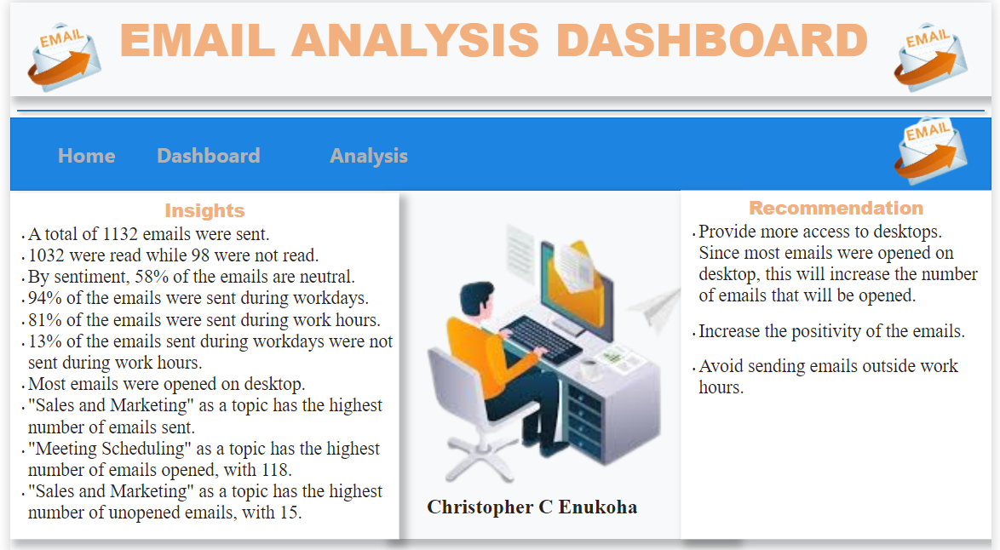
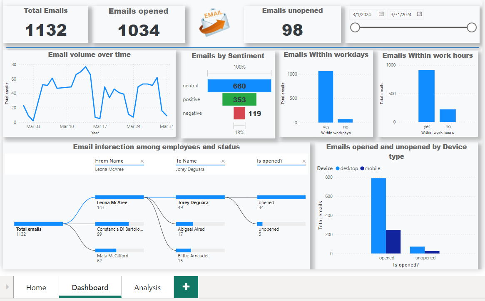
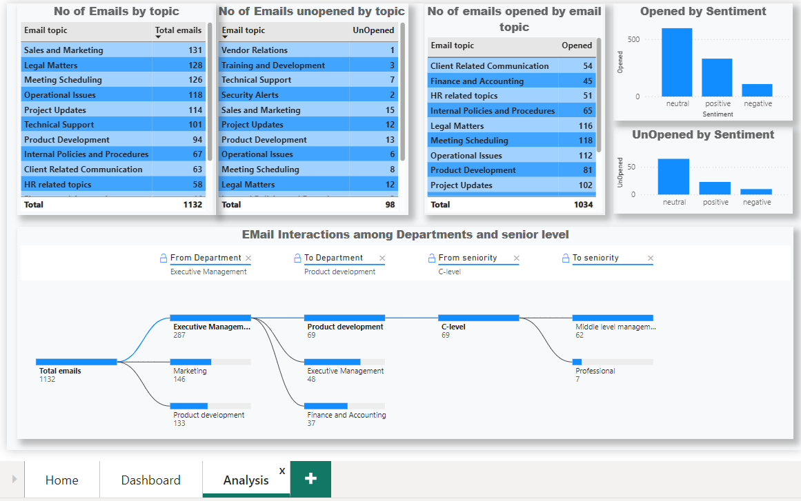

# Email Analysis Dashboard 

## Introduction: 
The project is project report delves into the email datasets of **March 2024** across **9 departments** made up of **47 employees** a total of **1,132 emails** spanning **14 different topics**,**91%** of these emails were **opened** which indicates the level of employee **professional engagement**, the report went in details to show the periods the emails were opened or not periods like during work hour, outside work hour, during the workday and outside workday, going further the reports also shows email interactions among departments and colleagues and finally **email sentiments.**

## Problem Statement:
This project tends to uncover the email analysis for a better understanding of how an employee interacts with work emails in terms of communication in the workplace for better professional engagments. 

## Skills Demonstrated:
The skills demonstrated in this project include the excellent use of PowerBI to perform 
1.	Data Cleaning 
2.	creation of KPIs and Visualization.
3.	Statistical Analysis

## Data Sourcing:
The data for the project was provided by **DataDNA**

## Analysis:
The analysis is made up of two-page reports.
1.	The Home Page
2.	The Dashboard
3.	The analysis page

## Key Insights from the Analysis 

The analysis of the dataset provided various insights such as:

1) A total of 1132 emails were sent.

2) 1032 were read while 98 were not read.

3) By sentiment, 58% of the emails are neutral.

4) 94% of the emails were sent during workdays.

5) 81% of the emails were sent during work hours.

6) 13% of the emails sent during workdays were not sent during work hours.

7) Most emails were opened on the desktop.

8) "Sales and Marketing" as a topic has the highest number of emails sent.

9) "Meeting Scheduling" as a topic has the highest number of emails opened, with 118.

10) "Sales and Marketing" as a topic has the highest number of unopened emails, with 15.

## Recommendations
After careful analysis of the dataset, I made the following recommendations:

1) Provide more access to desktops. Since most emails are opened on desktops, this will increase the number of emails that are opened.

2) Increase the positivity of the emails.

3) Avoid sending emails outside work hours.

# Infograhphic View 

## The Home Page
The home page serves as the point of contact where the insights and recommendations are placed. 

## The Dashboard 
The dashboard presents an in-depth infographic view of the analysis 

## The Analysis Page
The Analysis page presents further analysis by delving into the email interactions among departments and colleagues 

## Conclusion:
This project was completed by __Christopher C Enukoha__  **Copy_right_2024**
